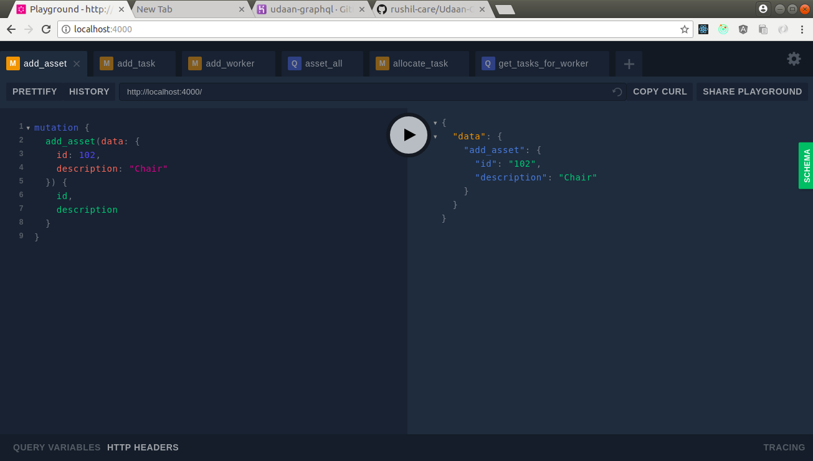
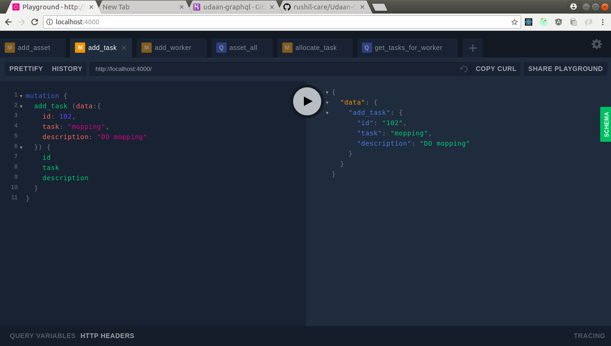
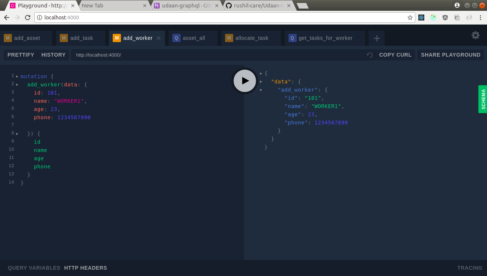
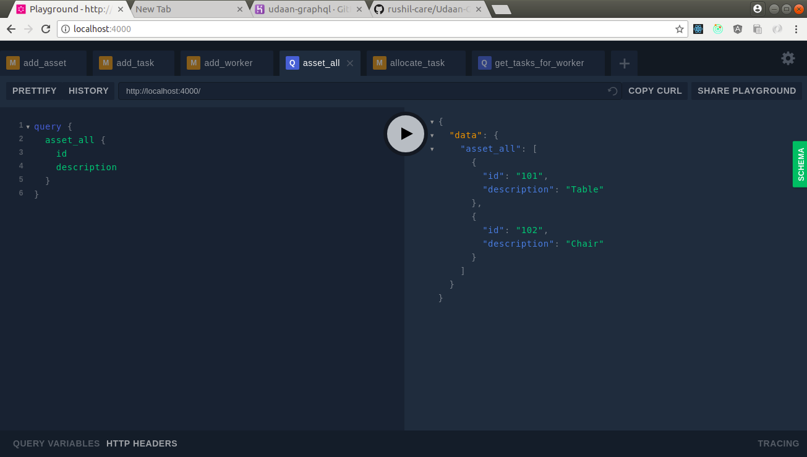
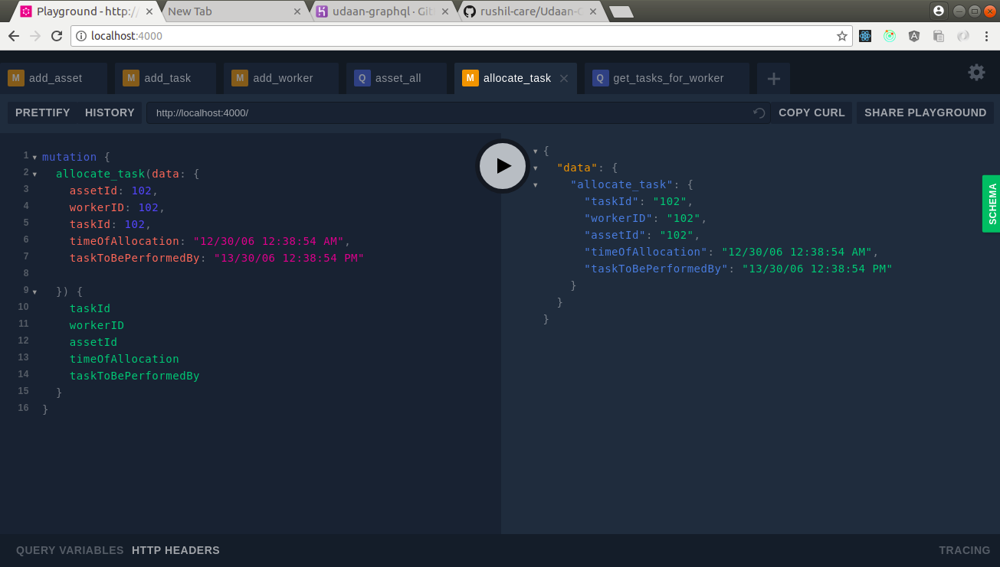
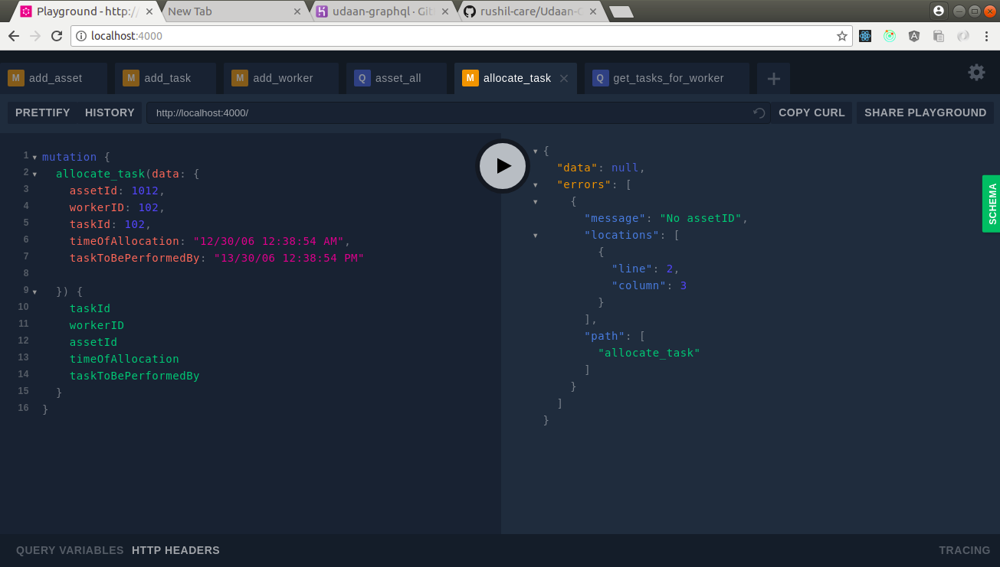
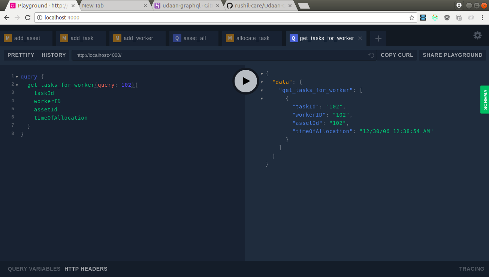

# Udaan-GraphQL
Udaan Hiring Challenge

<p align="center">
  
</p>

### To run the code:

On a **Linux**, **Mac OSX** and **Windows**:

```
$ npm install 
$ npm start
```

### Technologies Used

- Node.js
- GraphQL Yoga
- React.js
- Redux

### Demo
- **/add-asset**
<p align="center">
  
</p>

<p align="center">
  
</p>

- **/add-task**
<p align="center">
  
</p>

<p align="center">
  
</p>

- **/add-worker**
<p align="center">
  
</p>

<p align="center">
  
</p>

- **/assets/all**
<p align="center">
  
</p>

- **/allocate_task**
<p align="center">
  
</p>

<p align="center">
  
</p>

- **/get_tasks_for_worker/<worker-id>**
<p align="center">
  
</p>
